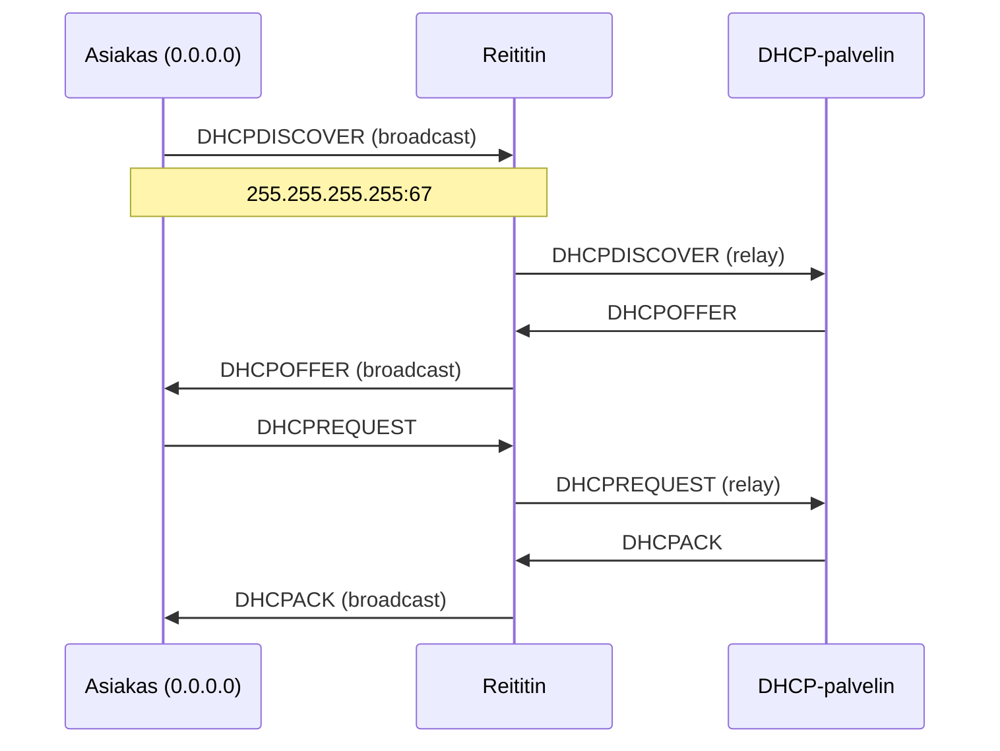

# DHCP-prosessi (DORA)

**DHCP-prosessi** on neljenvaiheinen vuoropuhelu asiakkaan ja palvelimen välillä, jossa asiakas saa verkkoasetukset. Se on tunnettu nimellä **DORA**: **Discover, Offer, Request, Acknowledge** (RFC 2131).

## Miksi DORA-prosessi on tärkeä?

Kun laitteisto käynnistetään verkkoon, sillä ei vielä ole osoitetta. Se tarvitsee keinon saadakseen sen ilman ihmisen puuttuvaa apua. DORA on tämä keino – automaaginen, ilman keskitettyä ohjausta.

## Prosessin 4 vaihetta

### 1. DHCPDISCOVER – Etsintä

Asiakas lähettää **broadcast**-viestin (siksi ei vielä osoitetta) porttiin 67→68:

```text
Lähde: 0.0.0.0:68 → Kohde: 255.255.255.255:67
DHCPDISCOVER
```

Kysymys kuuluu: "Onko jokainen DHCP-palvelin läsnä?"

### 2. DHCPOFFER – Tarjous

Jokainen kuullanut palvelin vastaa omaa tarjoamaan:

```text
Lähde: 192.168.1.5:67 → Kohde: 255.255.255.255:68
DHCPOFFER: osoite 192.168.1.100, maski 255.255.255.0,
  gateway 192.168.1.1, DNS 8.8.8.8
```

Asiakas valitsee yhden tarjouksista (yleensä ensimmäisen saatun).

### 3. DHCPREQUEST – Pyyntö

Asiakas ilmoittaa valitsemansa palvelimen: "Otetaan tämä tarjous!"

```text
Lähde: 0.0.0.0:68 → Kohde: 255.255.255.255:67
DHCPREQUEST: valittu tarjous 192.168.1.100
```

### 4. DHCPACK – Vahvistus

Palvelin vahvistaa: "Osoite on sinun."

```text
Lähde: 192.168.1.5:67 → Kohde: 255.255.255.255:68
DHCPACK: vahvistus 192.168.1.100
  + viitteet: routers=192.168.1.1, DNS=8.8.8.8
```

Nyt asiakkaalla on osoite ja järjestelmä voi aloittaa verkkotoiminnan.

## Prosessin visualisointi



## Miksi käytetään UDP:ta?

| Ominaisuus | Selitys |
|------------|---------|
| **Ei yhteyttä** | DHCP ei tarvitse yhteyttä |
| **Pieni kokoinen** | Viestit ovat lyhyitä |
| **Broadcast-tuki** | Paketit lähetetään koko verkolle |
| **Portit** | 67 = palvelin, 68 = asiakas |

## DHCPIN erityistapaukset

| Viesti | Käyttö |
|--------|--------|
| **DHCPNAK** | "Osoite ei ole enää sinun" – tyypillisesti vanhentuneen leasesta |
| **DHCPDECLINE** | "Tämä osoite on jo käytössä!" – asiakas hylkää tarjouksen |
| **DHCPRELEASE** | "Palan osoitteeni takaisin" – lopetetaan käyttö |
| **DHCPINFORM** | "Tarjoatko vielä asetuksia?" – esim. DNS ilman osoitetta |

## Leas-aika (Lease time)

Palvelin antaa asetuksia **vuokrana** – ellei asiakas päivitä sopimusta, osoite paluuvaraustavaksi. Tyypilliset arvot:

| Käyttötarkoitus | Leas-aika |
|----------------|------------|
| Kotiverkko | 24 h – 7 päivää |
| Liikkuvat laitteet | 1 h – 8 h |
| Palvelimet (kiinteät) | 1 vuosi (tai kiinteästi) |

## Seuraavaksi

Kun olet ymmärtänyt DORA-prosessin, näet [oletusyhdyskayta.md](oletusyhdyskayta.md), jossa selitettään, miten asiakaat pääsevät verkosta ulos – oletusyhdyskäytävän (default gateway) kautta.
